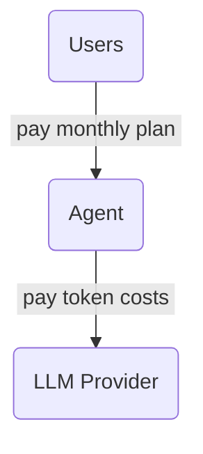
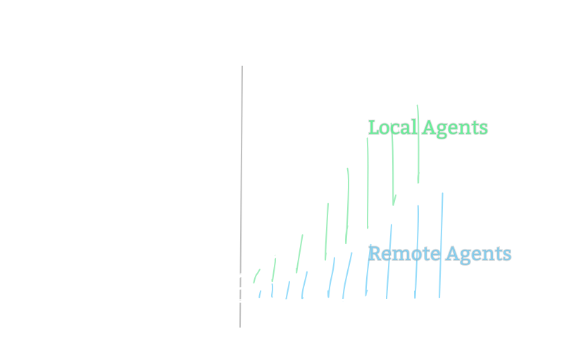
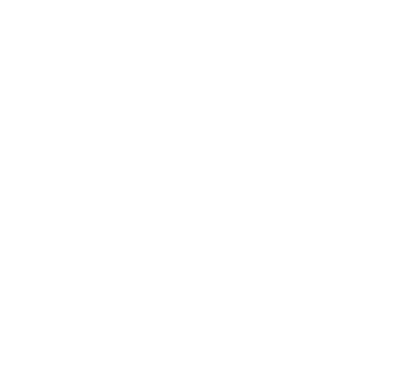
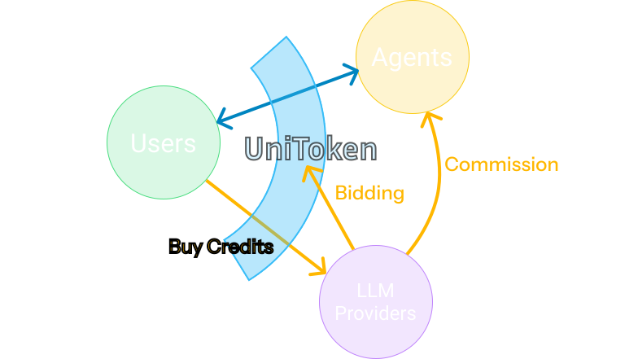

# Local-first  AI Token Platform

UniToken

---

# [Local AI Agents]{.text-primary.font-bold}[:]{.op-50} Dilemma

- Logics could run locally.
- But how to get LLM APIs?

<carbon-close-large text-red text-3xl mb--1 mx-2 />Too complex for users to provide

<carbon-arrow-right text-3xl mx-2 mb--1 text-yellow />[Paid plans]{.text-yellow} that include token costs

---

# Why is this bad? 😞

- Developers [earn less]{.text-red} as [usage grows]{.text-green}

  
 The opposite of traditional apps! 

 

- [Light users]{.text-yellow} avoid high fees

  
 Tokens are paid per-agent. 

---

# Just [let users pay]{.font-bold.text-primary} for tokens directly!

—— Once we make the process simple enough 😄

<table class="w-full">
  <thead text-sm>
    <tr>
      <th class="pb-1!"></th>
      <th class="pb-1! p-2 font-semibold">On first Agent</th>
      <th class="pb-1! p-2 font-semibold">On next Agent</th>
      <th class="pb-1! p-2 font-semibold">On the future...</th>
      <th class="pb-1!"></th>
    </tr>
  </thead>
  <tbody>
    <tr text-8px op-80>
      <td text-xl>
        Before
      </td>
      <td>
        <ol class="flex flex-col h-full">
          <li>Search for provider</li>
          <li>Visit OpenRouter.ai</li>
          <li>Sign up account</li>
          <li>Add credits</li>
          <li>Create API Key</li>
          <li>Go back to agent</li>
          <li>Copy&Paste API Key</li>
        </ol>
      </td>
      <td align-top>
        <ol class="flex flex-col h-full">
          <li>Visit OpenRouter.ai</li>
          <li>Sign in account</li>
          <li>Create API Key</li>
          <li>Go back to agent</li>
          <li>Copy&Paste API Key</li>
        </ol>
      </td>
      <td align-top>
        <ol class="flex flex-col h-full">
          <li>Visit OpenRouter.ai</li>
          <li>Sign in account</li>
          <li>Create API Key</li>
          <li>Go back to agent</li>
          <li>Copy&Paste API Key</li>
        </ol>
      </td>
      <!-- <td text-sm>
        

          
...

        

      </td> -->
    </tr>
    <tr text-xs>
      <td text-xl>
        After
      </td>
      <td>
        <ol class="flex flex-col h-full text-10px">
          <li>Auto open UniToken</li>
          <li>Sign up in-app</li>
          <li>Add credits in-app</li>
          <li>One-tap auth</li>
        </ol>
      </td>
      <td text-lg>
        One-tap auth
      </td>
      <td text-lg>
        One-tap auth
      </td>
      <!-- <td text-sm>
        

          
...

        

      </td> -->
    </tr>
  </tbody>
</table>

---
src: ./about-me.md
---

---

# Why Now?

- AI Agents **will** [blow up]{.font-bold.text-yellow}

- But [not yet]{.text-lightblue.font-bold}!

---

# How to Scale

## Stage 1 {.text-primary}

Open-source  
Local-first  
Lightweight

leads to [widespread adoption]{.text-xl.font-bold.text-green}

## Stage 2 {.text-primary}

Become a [standard]{.text-xl.font-bold} 
like the ["OpenAI Protocol"]{.text-xl.font-bold.text-yellow}

---

# How to Profit

---
src: ./final-word.md
---

---

